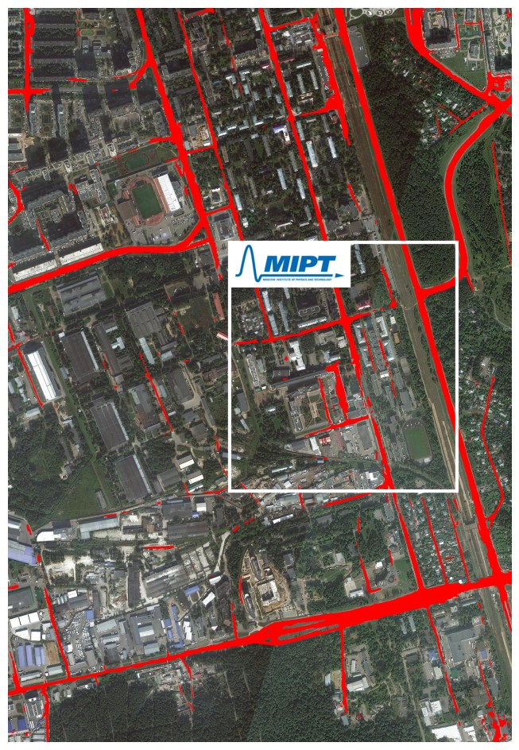
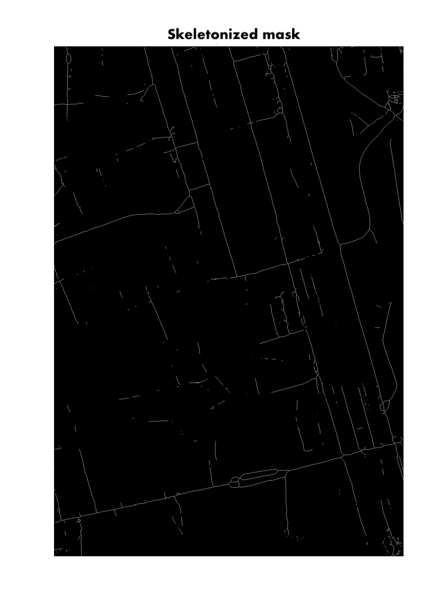
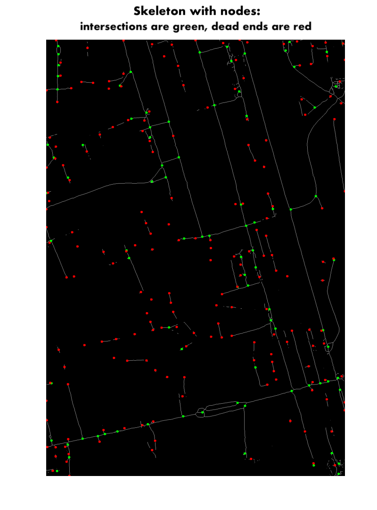

[](
https://nbviewer.org/github/RadyaSRN/MIPT-campus-satellite-road-network-mapping/blob/main/notebooks/road_mapping.ipynb)
[](
https://www.kaggle.com/kernels/welcome?src=https://github.com/RadyaSRN/MIPT-campus-satellite-road-network-mapping/blob/main/notebooks/road_mapping.ipynb)
[](
https://colab.research.google.com/github/RadyaSRN/MIPT-campus-satellite-road-network-mapping/blob/main/notebooks/road_mapping.ipynb)
[](
https://wandb.ai/radyasrn-mipt/CV-spring-2025/reports/CV-spring-2025-satellite-road-mapping--VmlldzoxMjA5NTU0OQ)

# MIPT campus road network mapping from satellite images
Road maps of the **MIPT campus (Moscow Institute of Physics and Technology)** and its surroundings are generated from satellite imagery using segmentation models (**UNet** and **DeepLabV3**) and road network graph reconstruction techniques.

<p align="center">
  
  
  
</p>

### Segmentation dataset
For model training the [DeepGlobe Road Extraction Dataset](https://www.kaggle.com/datasets/balraj98/deepglobe-road-extraction-dataset) was used, which contains approximately 6k images, each 1024x1024, with a scale of 50cm per pixel.

### Usage
* The first option is to open and run the notebook `/notebooks/road-mapping.ipynb` with comments and visualizations in Kaggle or Google Colab.

* The second option is cloning the repo, installing the needed requirements, and working locally:
```
git clone https://github.com/RadyaSRN/MIPT-campus-satellite-road-network-mapping.git
cd MIPT-campus-satellite-road-network-mapping
conda create -n roadnet python=3.10
conda activate roadnet
pip install -r requirements.txt
```
